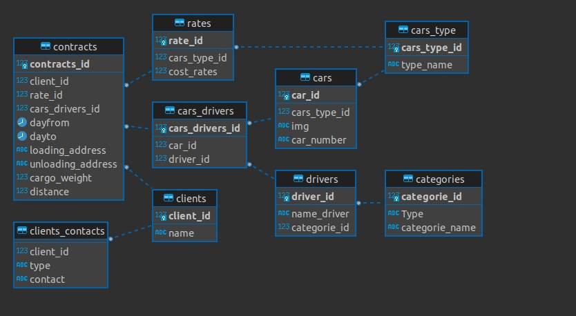

# Немножко теории

### Объекту можно назначить нового владельца с помощью команды ALTER для соответствующего типа объекта, например:
```SQl
ALTER TABLE имя_таблицы OWNER TO новый_владелец;
```
### Суперпользователь может делать это без ограничений, а обычный пользователь — только если он является одновременно текущим владельцем объекта (или членом роли владельца) и членом новой роли.

### Для назначения прав применяется команда GRANT. Например, если в базе данных есть роль role и таблица table, право на изменение таблицы можно дать этой роли так:
```SQl
GRANT UPDATE ON имя_таблицы TO название_роли;
```

### Если вместо конкретного права написать ALL, роль получит все права, применимые для объекта этого типа.

### Для назначения права всем ролям в системе можно использовать специальное имя «роли»: PUBLIC. Также для упрощения управления ролями, когда в базе данных есть множество пользователей, можно настроить «групповые» роли

***

###  начнём создавать инфраструктуру с таблицы типов машин
```SQL
CREATE TABLE public.cars_type (
cars_type_id serial NOT NULL,
type_name varchar NOT NULL,
CONSTRAINT cars_type_pk PRIMARY KEY (cars_type_id)
);
```

### Назначаю нового владельца
### и даю права доступа
```SQl
ALTER TABLE public.cars_type OWNER TO postgres;
GRANT ALL ON TABLE public.cars_type TO postgres;
```
***

### Далее добавлю таблицу с категориями прав
```SQL
CREATE TABLE public.categories (
"Type" varchar NULL,
categorie_name varchar NOT NULL,
categorie_id int NOT NULL DEFAULT nextval('categories_categories_id_seq'::regclass),
CONSTRAINT categories_pk PRIMARY KEY (categorie_id)
);
```

```SQL
ALTER TABLE public.categories OWNER TO postgres;
GRANT ALL ON TABLE public.categories TO postgres;
```
***

### Таблица с машинами где перечислины их: 
###### тип
###### номер
###### и тп
```SQL
CREATE TABLE public.cars (
car_id serial NOT NULL,
cars_type_id int NOT NULL,
img varchar NOT NULL,
car_number varchar NOT NULL,
CONSTRAINT cars_pk PRIMARY KEY (car_id),
CONSTRAINT cars_fk FOREIGN KEY (cars_type_id) REFERENCES public.cars_type(cars_type_id)
);
```

```SQL
ALTER TABLE public.cars OWNER TO postgres;
GRANT ALL ON TABLE public.cars TO postgres;
```
***

### Таблица клиентов с их контактными данными
```SQL
CREATE TABLE public.clients_contacts (
client_id int NOT NULL,
"type" varchar NOT NULL,
contact varchar NOT NULL,
CONSTRAINT clients_contacts_fk FOREIGN KEY (client_id) REFERENCES public.clients(client_id)
);
```

```SQL
ALTER TABLE public.clients_contacts OWNER TO postgres;
GRANT ALL ON TABLE public.clients_contacts TO postgres;

```
***
### Таблица клиентов
```SQL
CREATE TABLE public.clients (
client_id serial NOT NULL,
"name" varchar NOT NULL,
CONSTRAINT clients_pk PRIMARY KEY (client_id)
);
```

```SQL
ALTER TABLE public.clients OWNER TO postgres;
GRANT ALL ON TABLE public.clients TO postgres;
```

***

### Таблица с водителями и их категориями прав
###### Соеденина с таблицей categories по id
```SQL
CREATE TABLE public.drivers (
driver_id serial NOT NULL,
name_driver varchar NOT NULL,
categorie_id int NOT NULL,
CONSTRAINT drivers_pk PRIMARY KEY (driver_id),
CONSTRAINT drivers_fk FOREIGN KEY (categorie_id) REFERENCES public.categories(categorie_id)
);

```

```SQL
ALTER TABLE public.drivers OWNER TO postgres;
GRANT ALL ON TABLE public.drivers TO postgres;
```
***

### Таблица с ценами различных машин
```SQL
CREATE TABLE public.rates (
rate_id serial NOT NULL,
cars_type_id int NOT NULL,
cost_rates int NOT NULL,
CONSTRAINT rates_pk PRIMARY KEY (rate_id),
CONSTRAINT rates_fk FOREIGN KEY (cars_type_id) REFERENCES public.cars_type(cars_type_id)
);
```

```SQL
ALTER TABLE public.rates OWNER TO postgres;
GRANT ALL ON TABLE public.rates TO postgres;
```

***
### Эта таблица ближе составная и стостоит из:
###### cars
###### drivers
```SQL
CREATE TABLE public.cars_drivers (
cars_drivers_id int NOT NULL,
car_id int NOT NULL,
driver_id int NOT NULL,
CONSTRAINT cars_drivers_pk PRIMARY KEY (cars_drivers_id),
CONSTRAINT cars_drivers_fk FOREIGN KEY (car_id) REFERENCES public.cars(car_id),
CONSTRAINT cars_drivers_fk_1 FOREIGN KEY (driver_id) REFERENCES public.drivers(driver_id)
);
```
```SQL
ALTER TABLE public.cars_drivers OWNER TO postgres;
GRANT ALL ON TABLE public.cars_drivers TO postgres;
```
***

# самая главная таблица
```SQL
CREATE TABLE public.contracts (
contracts_id serial NOT NULL,
client_id int NOT NULL,
rate_id int NOT NULL,
cars_drivers_id int NOT NULL,
dayfrom date NOT NULL,
dayto date NOT NULL,
loading_address varchar NOT NULL,
unloading_address varchar NOT NULL,
cargo_weight int NOT NULL,
distance int NOT NULL,
CONSTRAINT contracts_pk PRIMARY KEY (contracts_id),
CONSTRAINT contracts_fk FOREIGN KEY (client_id) REFERENCES public.clients(client_id),
CONSTRAINT contracts_fk_1 FOREIGN KEY (cars_drivers_id) REFERENCES public.cars_drivers(cars_drivers_id),
CONSTRAINT contracts_fk_2
FOREIGN KEY (rate_id) REFERENCES public.rates(rate_id)
);
```

```SQL
ALTER TABLE public.contracts OWNER TO postgres;
GRANT ALL ON TABLE public.contracts TO postgres;
```
# Итог:

