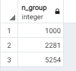

## <a name="3!!"></a>Многотабличные запросы

1. [Выведите на экран любое сообщение.](#3_1)
2. [Выведите на экран текущую дату.](#3_2)
3. [Создайте две числовые переменные и присвойте им значение. Выполните математические действия с этими числами и выведите результат на экран.](#3_3)
4. [Написать программу двумя способами 1 - использование IF, 2 - использование CASE. Объявите числовую переменную и присвоейте ей значение. Если число равно 5 - выведите на экран "Отлично". 4 - "Хорошо". 3 - Удовлетворительно". 2 - "Неуд". В остальных случаях выведите на экран сообщение, что введённая оценка не верна.](#3_4)
5. [Вывести фамилию, имя, зачетку, дату рождения студентов, которым исполнилось N полных лет на текущую дату, и которые имеют более 1 действующего хобби.](#3_5)
6. [Найти средний балл в каждой группе, учитывая только баллы студентов, которые имеют хотя бы одно действующее хобби.](#3_6)
7. [Найти название, риск, длительность в месяцах самого продолжительного хобби из действующих, указав номер зачетки студента.](#3_7)
8. [Найти все хобби, которыми увлекаются студенты, имеющие максимальный балл.](#3_8)
9. [Найти все действующие хобби, которыми увлекаются троечники 2-го курса.](#3_9)
10. [Найти номера курсов, на которых более 50% студентов имеют более одного действующего хобби.](#3_10)
11. [Вывести номера групп, в которых не менее 60% студентов имеют балл не ниже 4.](#3_11)
12. [Для каждого курса подсчитать количество различных действующих хобби на курсе.](#3_12)
13. [Вывести номер зачётки, фамилию и имя, дату рождения и номер курса для всех отличников, не имеющих хобби. Отсортировать данные по возрастанию в пределах курса по убыванию даты рождения.](#3_13)
14. [Создать представление, в котором отображается вся информация о студентах, которые продолжают заниматься хобби в данный момент и занимаются им как минимум 5 лет.](#3_14)
15. [Для каждого хобби вывести количество людей, которые им занимаются.](#3_15)
16. [Вывести ИД самого популярного хобби.](#3_16)
17. [Вывести всю информацию о студентах, занимающихся самым популярным хобби.](#3_17)
18. [Вывести ИД 3х хобби с максимальным риском.](#3_18)
19. [Вывести 10 студентов, которые занимаются одним (или несколькими) хобби самое продолжительно время.](#3_19)
20. [Вывести номера групп (без повторений), в которых учатся студенты из предыдущего запроса.](#3_20)
21. [Создать представление, которое выводит номер зачетки, имя и фамилию студентов, отсортированных по убыванию среднего балла.](#3_21)
22. [Представление: найти каждое популярное хобби на каждом курсе.](#3_22)
23. [Представление: найти хобби с максимальным риском среди самых распространенных хобби на 2 уровне.](#3_23)
24. [Представление: для каждого курса подбирается количество студентов на курсе и количество отличников.](#3_24)
25. [Представление: самое популярное хобби среди всех студентов.](#3_25)
26. [Создать обновляемое представление.](#3_26)
27. [Для каждой буквы алфавита из числа найденных величин, средних и балльных. (Т.е. среди всех студентов, чьё имя начинается на А (Алексей, Алина, Артур, Анджела) найти то, что указано в задании. Вывести на экран тех, средний балл проходит больше 3,6](#3_27)
28. [Для каждой фамилии характерна высокая степень тяжести и снижение балла. (Например, в университете учатся 4 Иванова (1-2-3-4). 1-2-3 учатся на 2 курсах и имеют средний балл 4.1, 4, 3.8, соответственно, а 4 Иванов учится на 3 курсах и имеет балл 4.5. На экране должно быть следующее:](#3_28)

id | surname | max | min
---|---------|-----|----    
2  | Иванов  | 4,1 | 3,8
3  | Иванов  | 4,5 | 4,5

29. [Для каждого года рождения подсчитывается количество хобби, наблюдаемое или занимавшееся студентами.](#3_29)
30. [Для каждой буквы алфавита в имени найти максимальный и минимальный риск хобби.](#3_30)
31. [Для каждого месяца из-за даты рождения студентов получаются средние баллы, которые являются хобби под названием «Футбол».](#3_31)
32. [Вывести информацию о студентах, которые занимались или занимались хотя бы 1 хобби в следующем формате: Имя: Иван, фамилия: Иванов, группа: 1234](#3_32)
33. [Внешний вид в какой-то по счёту символа встречается «ов». Если 0 (т.е. не встречается, то выведите на экран «не найдено»).](#3_33)
34. [Дополнить фамилию прямым символом # до 10 символов.](#3_34)
35. [При помощи функции удалить все символы # из полученного запроса.](#3_35)
36. [Выведите на экран количество дней в прошлом 2018 году.](#3_36)
37. [Вывести на экран какого числа будет ближайшая суббота.](#3_37)
38. [Выведите на экран век, а также какая сейчас неделя года и день года.](#3_38)
39. [Вы вводите всех студентов, которые занимались хотя бы 1 хобби. Выведите на экран Имя, Фамилию, Название хобби, а также надпись «занимается», если студент продолжает заниматься хобби в данный момент или «закончил», если уже не занимается.](#3_39)
40. [Для каждой группы приводят количество студентов учится на 5,4,3,2. Использовать обычное математическое округление. Итоговый результат должен выглядеть примерно так:](#3_40)

    | СЧЕТ | 2222 | 3011 | 4011 | 4032 |
    | ----- | ---- | ---- | ---- | ---- |
    | 2 | 0 | 0 | 0 | 1 |
    | 3 | 1 | 2 | 1 | 1 |
    | 4 | 4 | 3 | 3 | 3 |
    | 5 | 1 | 1 | 1 | 0 |

<br></br>

### <a name="3_1"></a> 1. Вывести все имена и фамилии студентов, и название хобби, которым занимается этот студент.

#### `Запрос`

```SQL

SELECT stud.name, stud.surname, h.hobby_name FROM student stud
INNER JOIN student_hobby sh ON stud.n_z = sh.id
INNER JOIN hobby h ON h.id = sh.id

```

#### `Вывод`


<br></br>


<br></br>

### <a name="3_2"></a> 2. Вывести информацию о студенте, занимающимся хобби самое продолжительное время.

#### `Запрос`

```SQL
SELECT (NOW ()-sh.started_at) as doing, *
FROM student stud
INNER JOIN student_hobby sh ON stud.n_z  = sh.student_id
INNER JOIN hobby h ON h.id = sh.hobby_id
WHERE sh.finished_at IS NULL
ORDER BY sh.started_at
LIMIT 1

```

#### `Вывод`


<br></br>

### <a name="3_3"></a> 3. Вывести имя, фамилию, номер зачетки и дату рождения для студентов, средний балл которых выше среднего, а сумма риска всех хобби, которыми он занимается в данный момент, больше 9.

#### `Запрос`

```SQL
SELECT stud.name, stud.surname, stud.n_z, stud.age
FROM student stud LEFT JOIN (
SELECT student_id, SUM(risk) FROM student_hobby sh
JOIN hobby h on sh.hobby_id = h.id
GROUP BY student_id) as nt 
ON stud.id=nt.student_id
WHERE stud.score>= (select AVG(score) FROM student) and nt.sum>9
```

#### `Вывод`


<br></br>

### <a name="3_4"></a> 4. Вывести фамилию, имя, зачетку, дату рождения, название хобби и длительность в месяцах, для всех завершенных хобби Диапазон дат.

#### `Запрос`

```SQL
SELECT stud.surname, stud.name, stud.n_z, stud.age  FROM student stud;
SELECT h.hobby_name FROM hobby h;

SELECT (sh.finished_at - sh.started_at)/30 as doing
FROM student stud
INNER JOIN student_hobby sh ON stud.n_z = sh.student_id
INNER JOIN hobby h ON h.id = sh.hobby_id
```

#### `Вывод`


<br></br>

### <a name="3_5"></a> 5. Вывести фамилию, имя, зачетку, дату рождения студентов, которым исполнилось N полных лет на текущую дату, и которые имеют более 1 действующего хобби.

#### `Запрос`

```SQL
SELECT stud.surname, stud.name, stud.n_z, stud.age
FROM student stud 
Inner JOIN (
SELECT student_id, (count(sh.started_at)-count(sh.finished_at)) as counter
FROM student_hobby sh
JOIN hobby h on sh.hobby_id = h.id
GROUP BY student_id) as nt 
ON stud.n_z=nt.student_id
WHERE stud.age>19 and nt.counter>1

```

#### `Вывод`


<br></br>

### <a name="3_6"></a> 6. Найти средний балл в каждой группе, учитывая только баллы студентов, которые имеют хотя бы одно действующее хобби.

#### `Запрос`

```SQL
SELECT stud.n_group, AVG(stud.score)
FROM student stud
INNER JOIN student_hobby sh on stud.n_z=sh.student_id
WHERE sh.finished_at IS NULL and sh.started_at IS NOT NULL
GROUP BY stud.n_group

```

#### `Вывод`


<br></br>

### <a name="3_7"></a> 7. Найти название, риск, длительность в месяцах самого продолжительного хобби из действующих, указав номер зачетки студента.

#### `Запрос`

```SQL
SELECT h.hobby_name as hobby, h.risk, 12*extract( days from (NOW ()-sh.started_at)) as doing, stud.n_z
FROM student stud
INNER JOIN student_hobby sh ON stud.n_z = sh.student_id
INNER JOIN hobby h ON h.id = sh.hobby_id
WHERE sh.finished_at IS NULL and stud.n_z=1
ORDER BY sh.started_at
```
### у меня выдало 2 строки, но можно  можно прописать Limit 1 в конце
#### `Вывод`


<br></br>

### <a name="3_8"></a> 8. Найти все хобби, которыми увлекаются студенты, имеющие максимальный балл.

#### `Запрос`

```SQL
SELECT 	h.hobby_name, max(stud.score) max_score
FROM 	student stud, hobby h, student_hobby sh
WHERE 	h.id= sh.hobby_id and 
      	stud.n_z= sh.student_id
GROUP BY h.hobby_name
```
### у меня мой запрос как-то криво работал
### поэтому я пока редактировал readme посмотрел как саня сделал
### но изменил под свои реали и всё нормально заработало
#### `Вывод`


<br></br>

### <a name="3_9"></a> 9. Найти все действующие хобби, которыми увлекаются троечники 2-го курса.

#### `Запрос`

### В теории должно работать
### но у меня просто нет троечников на 2 курсе
### Вывод: второкурсники-умные

```SQL
Ну вот что получилось просто у второкурсников
SELECT h.hobby_name as hobby
FROM hobby h
INNER JOIN
student_hobby sh on h.id = sh.hobby_id
INNER JOIN (SELECT stud.n_z
FROM student stud
WHERE stud.score=3 and n_group/1000=2)  stud on stud.n_z=sh.student_id
WHERE sh.finished_at IS NULL

```
### Ну вот что получилось просто у второкурсников
```SQL
SELECT h.hobby_name as hobby
FROM hobby h
INNER JOIN
student_hobby sh on h.id = sh.hobby_id
INNER JOIN (SELECT stud.n_z
FROM student stud
WHERE stud.score<6 and n_group/1000=2)  stud on stud.n_z=sh.student_id
WHERE sh.finished_at IS NULL
```
#### `Вывод`


<br></br>

### <a name="3_10"></a> 10. Найти номера курсов, на которых более 50% студентов имеют более одного действующего хобби.

### Взял у Паши, но он мне на паре объяснил что да как
### По итогу я забыл  как всё это работает
#### `Запрос`
```SQL
SELECT course_act.course
FROM
(SELECT course, COUNT(DISTINCT sh.student_id )as zanim
FROM student_hobby sh
INNER JOIN (
SELECT DISTINCT n_group/1000 as course, st.n_z
FROM student st) as nt on nt.n_z = sh.student_id
WHERE finished_at IS NULL
GROUP BY course) as course_act
RIGHT JOIN
(SELECT n_group/1000 as course, COUNT(*) from student st GROUP BY n_group/1000) as course_all 
on course_act.course = course_all.course
WHERE course_act.zanim*1./course_all.count>0.5
```

#### `Вывод`


<br></br>


### <a name="3_11"></a> 11. Вывести номера групп, в которых не менее 60% студентов имеют балл не ниже 4.

#### `Запрос`

```SQL
SELECT n_group FROM student
GROUP BY n_group
HAVING COUNT(CASE
    WHEN score>=4 THEN 1
    ELSE NULL END)/COUNT(*)>=0.6

```

#### `Вывод`


<br></br>

### <a name="3_12"></a> 12.  Для каждого курса подсчитать количество различных действующих хобби на курсе.

#### `Запрос`

```SQL
SELECT n_group/1000 as course, COUNT(DISTINCT h.hobby_name)
FROM student as stud
RIGHT JOIN student_hobby as sh on sh.student_id=stud.n_z
Left JOIN hobby as h on h.id=sh.hobby_id
GROUP BY n_group/1000
```

#### `Вывод`


<br></br>

### <a name="3_13"></a>  13. Вывести номер зачётки, фамилию и имя, дату рождения и номер курса для всех отличников, не имеющих хобби. Отсортировать данные по возрастанию в пределах курса по убыванию даты рождения.

#### `Запрос`

```SQL
SELECT stud.n_z, stud.surname, stud.name, stud.age, n_group/1000 as course
FROM student as stud
LEFT JOIN student_hobby as sh on sh.student_id=stud.n_z
Left JOIN hobby as h on h.id=sh.hobby_id
WHERE sh.hobby_id is NULL and score=5
ORDER BY course, stud.age DESC
```

#### `Вывод`


### ну не оказалось таких, ну бывает
<br></br>

### <a name="3_14"></a> 14. Создать представление, в котором отображается вся информация о студентах, которые продолжают заниматься хобби в данный момент и занимаются им как минимум 5 лет.

#### `Запрос`

```SQL
CREATE OR REPLACE VIEW full_info AS
SELECT distinct stud.n_z, stud.name, stud.surname,stud.adress,stud.score,stud.n_group,stud.age
FROM student stud 
RIGHT JOIN student_hobby sh on stud.n_z=sh.student_id
WHERE finished_at is null and  extract(year from (clock_timestamp ( )-sh.started_at))>5
```

#### `Вывод`


### никого у меня нет, кто дольше 5 лет занимается
### Вот вывод без условий


<br></br>

### <a name="3_15"></a> 15. Для каждого хобби вывести количество людей, которые им занимаются.

#### `Запрос`

```SQL
SELECT h.hobby_name, COUNT((sh.student_id, sh.hobby_id)) as count 
FROM hobby h LEFT JOIN student_hobby sh on h.id=sh.hobby_id
WHERE sh.finished_at is null
GROUP BY h.hobby_name
```

#### `Вывод`


### У меня всего 5 null у finished_at, поэтому всё ок
<br></br>

### <a name="3_16"></a> 16. Вывести ИД самого популярного хобби.

#### `Запрос`

```SQL
SELECT id FROM(
SELECT h.id, COUNT((sh.student_id, sh.hobby_id))
FROM hobby h LEFT JOIN student_hobby sh on h.id=sh.hobby_id
WHERE sh.finished_at is null
GROUP BY h.id 
ORDER BY count desc limit 1) as popular_hobby
```

#### `Вывод`


<br></br>

### <a name="3_17"></a> 17. Вывести всю информацию о студентах, занимающихся самым популярным хобби.

#### `Запрос`

```SQL
SELECT * FROM student stud RIGHT JOIN (
Select student_id from student_hobby sh
RIGHT JOIN( SELECT h.id  FROM hobby h LEFT JOIN student_hobby sh on h.id=sh.hobby_id
WHERE sh.finished_at is null
GROUP BY h.id
ORDER BY COUNT(distinct (sh.student_id, sh.hobby_id)) desc limit 1) as besth on besth.id=sh.hobby_id
WHERE finished_at is null) as stid on stud.n_z = stid.student_id
```

#### `Вывод`


### И ещё колонка со student_id=6
<br></br>

### <a name="3_18"></a> 18. Вывести ИД 3х хобби с максимальным риском.

#### `Запрос`

```SQL
SELECT id FROM hobby
ORDER BY risk desc limit 3
```

#### `Вывод`


### Мне страшно, что такой маленький запрос вышел
<br></br>

### <a name="3_19"></a> 19. Вывести 10 студентов, которые занимаются одним (или несколькими) хобби самое продолжительно время.

#### `Запрос`

```SQL
SELECT distinct stud.n_z, stud.name, stud.surname,stud.n_group sh.started_at FROM
student stud RIGHT JOIN student_hobby sh on stud.n_z=sh.student_id
WHERE sh.finished_at is null
ORDER BY sh.started_at limit 5
```

#### `Вывод`


### О, там даже я есть(самый первый)    
<br></br>

### <a name="3_20"></a> 20. Вывести номера групп (без повторений), в которых учатся студенты из предыдущего запроса.

#### `Запрос`

```SQL
SELECT distinct n_group from
(SELECT distinct stud.n_z, stud.name, stud.surname,stud.n_group, sh.started_at FROM
student stud RIGHT JOIN student_hobby sh on stud.n_z=sh.student_id
WHERE sh.finished_at is null
ORDER BY sh.started_at limit 5 ) as groupsss
```

#### `Вывод`



<br></br>


### <a name="3_21"></a> 21. Создать представление, которое выводит номер зачетки, имя и фамилию студентов, отсортированных по убыванию среднего балла.

#### `Запрос`

```SQL
CREATE OR REPLACE VIEW not_full_info AS
SELECT n_z, name, surname
FROM student
ORDER BY score desc

```

#### `Создал`


### Тут я выведу инфу из представления

```SQL
SELECT * FROM not_full_info;
```

### `Вывод`


<br></br>

### <a name="3_22"></a> 22. Представление: найти каждое популярное хобби на каждом курсе.

#### `Запрос`

```SQL
тут должен быть запрос, но я не понял как это сделать
Что-то пробовал, но ничего не получилось
```

<br></br>

### <a name="3_23"></a> 23. Представление: найти хобби с максимальным риском среди самых распространенных хобби на 2 уровне.

#### `Запрос`

```SQL
Аналоогично 22-му
```

<br></br>

### <a name="3_24"></a> 24. Представление: для каждого курса подбирается количество студентов на курсе и количество отличников.

#### `SQL запрос и Вывод`


<br></br>

### <a name="3_25"></a> 25. Представление: самое популярное хобби среди всех студентов.

#### `Запрос и Вывод`


###### ахахахах

<br></br>

### <a name="3_26"></a> 26. Создать обновляемое представление.

#### `Запрос`

```SQL
CREATE VIEW updatable as
SELECT * FROM hobby;

SELECT * FROM updatable;
```

#### `Вывод`


###### В таких представлениях мы можем изменить или удалить строки или добавить в них новые строки.
<br></br>

### <a name="3_27"></a> 27. Для каждой буквы алфавита из числа найденных величин, средних и балльных. (Т.е. среди всех студентов, чьё имя начинается на А (Алексей, Алина, Артур, Анджела) найти то, что указано в задании. Вывести на экран тех, средний балл проходит больше 3,6

#### `Запрос`


#### `SQL запрос и Вывод`


### Нужно добавить ещё 1 строчку
```SQL
HAVING max(score)>3.6
```
### И тогда улетят Pashka, Pushka and Pivo(имена на букву P)
### Я просто тестил всякое тут
<br></br>

### <a name="3_28"></a> 28. Для каждой фамилии характерна высокая степень тяжести и снижение балла. (Например, в университете учатся 4 Иванова (1-2-3-4). 1-2-3 учатся на 2 курсах и имеют средний балл 4.1, 4, 3.8, соответственно, а 4 Иванов учится на 3 курсах и имеет балл 4.5. На экране должно быть следующее:
курс | фамилия | max | min
-----|---------|-----|-----
2    | Иванов  | 4,1 | 3,8
3    | Иванов  | 4,5 | 4,5

#### `Запрос`

```SQL
SELECT n_group/1000 as course, surname, max(score),min(score) 
FROM student
GROUP BY n_group/1000, surname

```

#### `Вывод`


<br></br>

### <a name="3_29"></a> 29. Для каждого года рождения подсчитывается количество хобби, наблюдаемое или занимавшееся студентами.

#### `Запрос`

```SQL
SELECT age, COUNT(distinct hobby_id)
FROM student stud RIGHT JOIN student_hobby sh on stud.n_z = sh.student_id
GROUP BY age
```
### можно ещё через date_of_birth, но я только потом его добавил


#### `Вывод`


<br></br>

### <a name="3_30"></a> 30. Для каждой буквы алфавита в имени найти максимальный и минимальный риск хобби.

#### `Запрос`

```SQL
SELECT left(stud_tabl.name,1), min(risk), max(risk)
FROM (student stud RIGHT JOIN student_hobby sh on stud.n_z = sh.student_id) as stud_tabl
LEFT JOIN hobby h on h.id=stud_tabl.student_id
GROUP BY left(stud_tabl.name,1)

```

#### `Вывод`


<br></br>


### <a name="3_31"></a> 31. Для каждого месяца из-за даты рождения студентов получаются средние баллы, которые являются хобби под названием «Футбол».

### Предисловие
###### Тут Паша сказал создать колонку с годом рождения, ну я послушался и создал

###### через вот такие запросики(если задавать с ограничением на NULL, то от будет выдавать ошибку)
###### поэтому создал пока без ограничения(все значения стали null)
###### а потом заполнил их в ручну(2022 - age и рандомные месяца с днями)

```SQL
ALTER TABLE student
ADD date_of_birth DATE;

```
###### Потом добавил ограничения
```SQL
ALTER TABLE student 
ALTER COLUMN date_of_birth 
SET NOT NULL;
```
###### я только потом увидел, что можно добавлять колонку сразу с ограничением
###### просто изначальные значения поставить не заполнено или тип того
###### ну да и ладно
### Итог:


#### `Запрос`

```SQL
SELECT extract(month from date_of_birth) as month, avg(score)
FROM (student stud right join student_hobby sh on sh.student_id=stud.n_z) as month_table left join hobby h on h.id=month_table.hobby_id
WHERE finished_at is null and h.hobby_name='dance' 
GROUP BY month
```

#### `Вывод`


### футбола у меня нет, поэтому вывел dance

<br></br>

### <a name="3_32"></a> 32. Вывести информацию о студентах, которые занимались или занимались хотя бы 1 хобби в следующем формате: Имя: Иван, фамилия: Иванов, группа: 1234
#### `Запрос`

```SQL
SELECT distinct 'Имя: '||stud.name||', фамилия: '||stud.surname||', группа: '||stud.n_group 

FROM student stud RIGHT JOIN student_hobby sh on stud.n_z=sh.student_id
```

#### `Вывод`


<br></br>

### <a name="3_33"></a> 33. Внешний вид в какой-то по счёту символа встречается «ов». Если 0 (т.е. не встречается, то выведите на экран «не найдено»).
#### `Запрос`

```SQL
SELECT case position('ов' in surname)::varchar
when '0' then 'не найдено'
else position('ов' in surname)::varchar end
FROM student
```

#### `Вывод`


<br></br>

### <a name="3_34"></a> 34. Дополнить фамилию прямым символом # до 10 символов.

#### `Запрос`

```SQL
SELECT case 
when (length(surname)>10) then surname
else rpad(surname,10,'#') end
FROM student

```

#### `Вывод`


<br></br>

### <a name="3_35"></a> 35. При помощи функции удалить все символы # из полученного запроса.

#### `Запрос`

```SQL
SELECT rtrim(surname,'#')
FROM( SELECT case 
when (length(surname)>10) then surname
else rpad(surname,10,'#')
end as surname
FROM student) as norm_tabl

```

#### `Вывод`


<br></br>

### <a name="3_36"></a> 36. Выведите на экран количество дней в прошлом 2018 году.

#### `Запрос`

```SQL
SELECT extract(days FROM date_trunc('month', '4-1-2018'::date) + interval '1 month - 1 day');
```

#### `Вывод`


### Посмотрел, с февралём тоже работает

```SQL
SELECT extract(days FROM date_trunc('month', '2-1-2020'::date) + interval '1 month - 1 day');
```
#### `Вывод`


```SQL
SELECT extract(days FROM date_trunc('month', '2-1-2018'::date) + interval '1 month - 1 day');
```
#### `Вывод`


<br></br>

### <a name="3_37"></a> 37. Вывести на экран какого числа будет ближайшая суббота.

### Нашёл 2 способа на stackoverflow пришлось их чуток переделать

#### `Запрос`

```SQL
SELECT current_date + cast(abs(extract(dow FROM current_date) - 7) - 1 AS int);

SELECT current_date+7 - (( cast(extract(dow FROM current_date) AS int)+1) %8)

```

#### `Вывод`


<br></br>

### <a name="3_38"></a> 38. Выведите на экран век, а также какая сейчас неделя года и день года.

#### `Запрос`

```SQL
Select
extract(century from current_date) as century,
extract(weeks from current_date) as weeknumber,
extract(days from current_date) as daynumber; 
```

#### `Вывод`


<br></br>

### <a name="3_39"></a> 39. Вы вводите всех студентов, которые занимались хотя бы 1 хобби. Выведите на экран Имя, Фамилию, Название хобби, а также надпись «занимается», если студент продолжает заниматься хобби в данный момент или «закончил», если уже не занимается.

#### `Запрос`

```SQL
SELECT stud.name, stud.surname, h.hobby_name,
case
when (sh.finished_at is null) then 'Закончил'
else 'Занимается' end

FROM student stud RIGHT JOIN student_hobby sh on stud.n_z=sh.student_id LEFT JOIN hobby h on h.id = sh.hobby_id

```

#### `Вывод`


######наконец-то нормальные запросы, а то прошлые с датами мне не понравились

<br></br>

### <a name="3_40"></a> 40. Для каждой группы приводят количество студентов учится на 5,4,3,2. Использовать обычное математическое округление. Итоговый результат должен выглядеть примерно так:


СЧЕТ  | 2222 | 3011 | 4011 | 4032 
----- | ---- | ---- | ---- | ---- 
2     | 0    | 0    | 0    | 1 
3     | 1    | 2    | 1    | 1 
4     | 4    | 3    | 3    | 3 
5     | 1    | 1    | 1    | 0 

#### `Запрос`

```SQL
SELECT n_group,
count(case round(score) when 2 then 1 end) as "2",
count(case round(score) when 3 then 1 end) as "3",
count(case round(score) when 4 then 1 end) as "4",
count(case round(score) when 5 then 1 end) as "5"
FROM student
GROUP BY n_group

```

#### `Вывод`


<br></br>


# ИТОГ:

### В целом то, что было непонятно я спросил у Паши с Костей, а так нужно всё на практике фигачить

